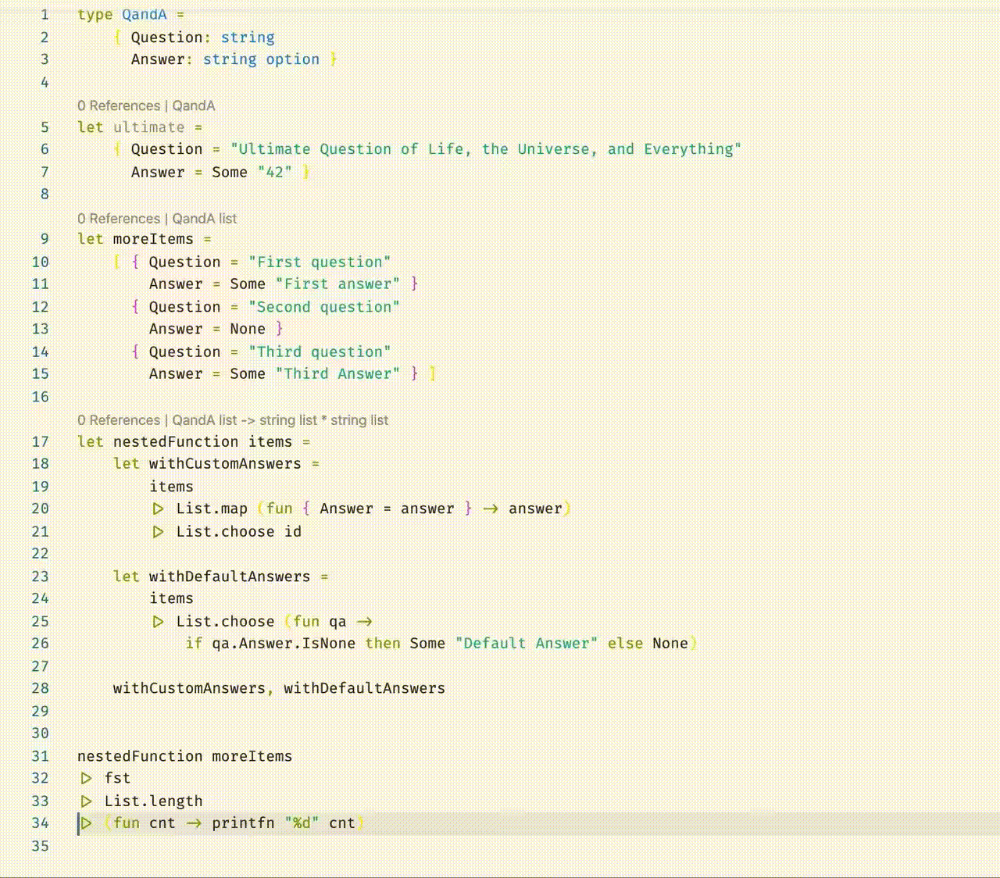

# F# interactive helpers

Easier movement and code selection when working with F# interactive.

Available in the [Visual Studio Marketplace](https://marketplace.visualstudio.com/items?itemName=kijowski.fsi-helpers)

## Features

### Demo video

### Select top level form

This command tries to select top level form that encapsulate current cursor position. 

It is useful when you make an edit inside longer function / type definition / data pipeline and you want to reevaluate it in FSI.

### Go to current/previous/next top level form

This commands navigate to start of current/previous/next top level form from current cursor position.

They are useful for fluent code navigation.

## Default bindings
- Select top level form: <kbd>Alt + \\</kbd>
- Go to previous top level form: <kbd>Alt + '</kbd>
- Go to current top level form: <kbd>Alt + [</kbd>
- Go to next top level form: <kbd>Alt + ]</kbd>

## Requirements

This is not a requirement, but this extension works best with [Ionide extension](https://marketplace.visualstudio.com/items?itemName=Ionide.Ionide-fsharp), especially the default bindings are convenient when used with default Ionide binding for sending selection to FSI.

## Known Issues

Currently code navigation is not using AST, but is based on string matching. Because of that it might not be 100% correct, especially with poorly/weirdly formatted code. 

## Release Notes

### 0.0.1
- Initial release

### 0.0.2
- Update README

### 0.0.3
- Fix CHANGELOG
- Add demo video
